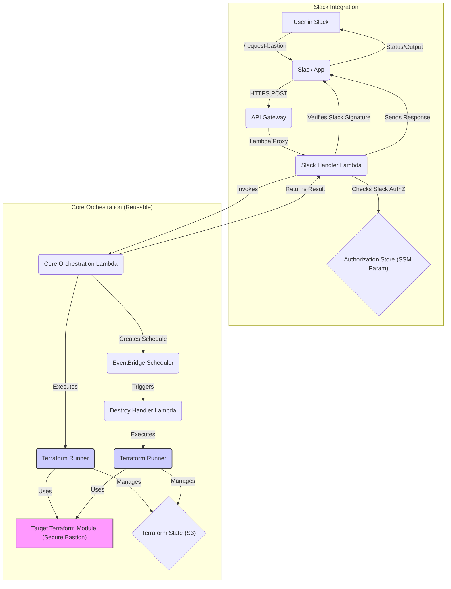

# Automation Layer for On-Demand Terraform Deployments via Slack

## Overview

This Terraform configuration deploys an AWS serverless application that acts as an automation layer, allowing authorized Slack users to trigger Terraform deployments on demand. Initially configured to deploy the `terraform-aws-secure-bastion` module (located in the parent directory), its core orchestration logic is designed to be potentially reusable for other Terraform tasks triggered via Slack or other interfaces.

The primary goal is to provide a secure, audited, and user-friendly way to provision temporary resources like bastion hosts without requiring users to have direct AWS console or Terraform CLI access for that specific task.

🚀🛠️ My long term goal is to expand upon this automation layer feature into its own project where it becomes an entire ChatOps (Slack/Teams/Webex/etc.) orchestration framework for seamless (and secure) infrastructure deployment, SecOps tasks, and more.

## Architecture



*   **Slack App:** A user invokes a Slash Command (e.g., `/request-bastion`).
*   **API Gateway (HTTP API):** Receives the HTTPS POST from Slack and triggers the `Slack Handler Lambda`.
*   **Slack Handler Lambda:**
    *   Verifies the Slack request signature (security).
    *   Parses the command and user details.
    *   Checks if the Slack User ID is authorized via an SSM Parameter list (security).
    *   Sends an immediate acknowledgment back to Slack.
    *   Invokes the `Core Orchestration Lambda` asynchronously.
*   **Core Orchestration Lambda:**
    *   Receives validated parameters.
    *   Generates a unique `SessionID`.
    *   Copies the target Terraform module code (the bastion module).
    *   Runs `terraform init` and `terraform apply` in a temporary directory, using an S3 backend with a unique state file key (`bastion-state/<SessionID>.tfstate`).
    *   Parses the `bastion_instance_id` from the output.
    *   Creates a one-time EventBridge schedule to trigger the `Destroy Handler Lambda` after the configured lifetime.
    *   Sends the connection details or error message back to Slack via the `response_url` provided by the `Slack Handler`.
*   **Destroy Handler Lambda:**
    *   Triggered by EventBridge Scheduler.
    *   Retrieves the `SessionID`.
    *   Runs `terraform init` and `terraform destroy` using the specific state file key for that session.
*   **Supporting Resources:**
    *   **AWS Secrets Manager:** Securely stores the Slack Signing Secret and Bot Token.
    *   **SSM Parameter Store:** Stores the list of authorized Slack User IDs.
    *   **S3 Bucket:** Stores Terraform state for the automation layer itself and the individual bastion sessions.
    *   **IAM Roles:** Least-privilege roles for each Lambda and EventBridge Scheduler.
    *   **Lambda Container Images:** Built using the provided Dockerfiles, containing Python code, dependencies, Terraform binary, and bastion module code.

## Prerequisites

*   Terraform v1.8+ (or the version specified in `automation-layer/main.tf`)
*   AWS Provider ~> 5.40 (or the version specified in `automation-layer/main.tf`)
*   AWS CLI configured with appropriate permissions to deploy these resources.
*   Docker (or compatible container build tool like `buildx`) installed locally to build Lambda container images.
*   An AWS ECR repository (or repositories) to push the Lambda container images to.
*   A Slack App configured (see Setup).
*   The `terraform-aws-secure-bastion` module code available locally (expected in the parent directory `../` by default, configurable via `bastion_module_source` variable).

## Setup Steps

1.  **Configure Slack App:**
    *   Create a new Slack App in your workspace.
    *   Navigate to "Slash Commands" and create a new command (e.g., `/request-bastion`).
    *   Set the "Request URL" to the `api_gateway_endpoint` output from your Terraform deployment (you'll deploy Terraform first, then update this).
    *   Navigate to "Basic Information" -> "App Credentials". Note the **Signing Secret**.
    *   Navigate to "OAuth & Permissions". Add the `chat:write` scope under "Bot Token Scopes". Install/reinstall the app to your workspace. Note the **Bot User OAuth Token**.
    *   *(Optional: Add other scopes if needed for richer interactions).*

2.  **Store Slack Secrets in AWS Secrets Manager:**
    *   Create a secret in AWS Secrets Manager for the Slack **Signing Secret**. Note its ARN.
    *   Create another secret for the Slack **Bot User OAuth Token**. Note its ARN.
    *   Ensure the region matches where you deploy the automation layer.

3.  **Prepare Authorized User List:**
    *   Decide on the name for the SSM Parameter (default: `/slack-bastion/authorized-users`).
    *   You will need to populate this parameter *after* the initial Terraform deployment with a comma-separated list of authorized Slack User IDs (e.g., `U012ABCDEF,U987XYZ12`).

4.  **Build and Push Lambda Container Images:**
    *   Navigate to `automation-layer/lambda/slack_handler/`. Build the Docker image and push it to your ECR repository (e.g., `aws ecr get-login-password ... | docker login ... && docker build -t <account-id>.dkr.ecr.<region>.amazonaws.com/<repo-name>:slack-handler-latest . && docker push ...`). Note the full image URI.
    *   Navigate to `automation-layer/lambda/core_orchestrator/`. Build the Docker image (this image contains code for both orchestrator and destroyer) and push it to your ECR repository (e.g., `docker build -t <account-id>.dkr.ecr.<region>.amazonaws.com/<repo-name>:core-latest . && docker push ...`). Note the full image URI.
    *   *Note:* You might need separate ECR repos or tags depending on your setup. Ensure the image architecture matches your Lambda function's architecture setting (usually `amd64` or `arm64`).

5.  **Deploy Terraform Infrastructure:**
    *   Navigate to the `automation-layer/` directory.
    *   Configure the S3 backend in `main.tf` (uncomment and fill in details) or use backend config files/CLI arguments.
    *   Create a `terraform.tfvars` file (or use environment variables/CLI flags) to provide values for required variables, including:
        *   `aws_region`
        *   `terraform_state_bucket_name` (choose a unique name)
        *   `slack_signing_secret_arn` (from Step 2)
        *   `slack_bot_token_secret_arn` (from Step 2)
        *   `bastion_vpc_id`
        *   `bastion_subnet_id`
        *   *(Review other variables in `variables.tf` for defaults)*
    *   Update the placeholder `image_uri` values in `automation-layer/main.tf` within the `aws_lambda_function` resources to match the actual ECR image URIs you pushed in Step 4.
    *   Run `terraform init`.
    *   Run `terraform apply`. Note the `api_gateway_endpoint` output.

6.  **Update Slack App Request URL:**
    *   Go back to your Slack App configuration -> "Slash Commands".
    *   Paste the `api_gateway_endpoint` output from Terraform into the "Request URL" field for your command. Save changes.

7.  **Populate Authorized Users:**
    *   Using the AWS Console or CLI, update the SSM Parameter specified by `authorized_slack_user_ids_ssm_param_name` with the actual comma-separated list of Slack User IDs allowed to use the command.

## Usage

Once deployed and configured:

1.  An authorized user goes to Slack.
2.  They type the Slash Command, optionally adding parameters (e.g., `lifetime=120`):
    ```
    /request-bastion lifetime=120 type=t3.small
    ```
3.  The user receives an immediate ephemeral acknowledgment message.
4.  If successful, after Terraform completes, the user receives another ephemeral message with the bastion instance ID and the `aws ssm start-session` command.
5.  If an error occurs (authorization failure, Terraform error, scheduling error), the user receives an error message.
6.  The bastion host is automatically destroyed after the specified lifetime via the scheduled `Destroy Handler Lambda`.

## Security Considerations

*   **Slack Signature Verification:** Implemented in the `Slack Handler` to prevent forged requests. **Crucial**.
*   **IAM Least Privilege:** Roles are defined per function. **IMPORTANT:** The broad Terraform execution permissions in the `CoreOrchestratorLambdaRole` and `DestroyLambdaRole` policies (`Resource = "*"`) are **placeholders** and **MUST be scoped down** to only the actions and resources required by the specific Terraform module being managed (the bastion module in this case). Failure to do so grants excessive permissions. Consider using IAM Permission Boundaries or dynamic role assumption for more complex scenarios.
*   **Secret Management:** Slack secrets are stored securely in AWS Secrets Manager.
*   **Authorization:** User access is controlled via an explicit list of Slack User IDs in SSM Parameter Store.
*   **Input Validation:** Basic validation is included in the Lambda placeholders, but should be enhanced to strictly validate all expected parameters from Slack commands.
*   **Error Handling:** Basic error handling is included, but ensure no sensitive details are leaked in error messages sent back to Slack.
*   **State Isolation:** Terraform state for each bastion session is isolated using unique keys in the S3 backend, preventing accidental destruction of unrelated resources.
*   **VPC Endpoints:** Using VPC Endpoints for AWS services (Secrets Manager, SSM Parameter Store, S3, Lambda, ECR, EventBridge Scheduler) allows the Lambda functions to run in private subnets without internet access, enhancing security. This Terraform code includes optional `lambda_subnet_ids` and `lambda_security_group_ids` variables to configure Lambda VPC access, but you must create the necessary VPC Endpoints and configure routing/security groups separately. This is highly recommended for production environments.

## Terraform Inputs and Outputs

*   See `variables.tf` for all configurable input variables for the automation layer, including VPC settings for the Lambdas.
*   See the `output` blocks in `main.tf` for values exported after deployment (e.g., API Gateway endpoint, S3 bucket name, IAM role ARNs).
